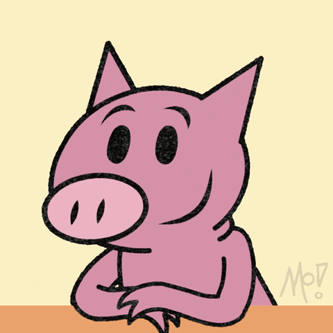

  
  <h1>Hey, I'm Michael 🎱</h1>

* I've been learning to program for the past 5 years, learning bits of everything from full stack web app development to visual sorting algorithms (whatever rabbithole I fall into 🫠)
* I am obsessed with all things cybersecurity, in particular networking. I love making little (harmless) malware scripts for my friends and going on rants about anonymization.

# PSA: Join the I2P network.
Believe in decentralization of data? Care about anonymity? Free speech? Democracy?

[Together, we can build an internet where you can be invisible.](https://geti2p.net/en/)
