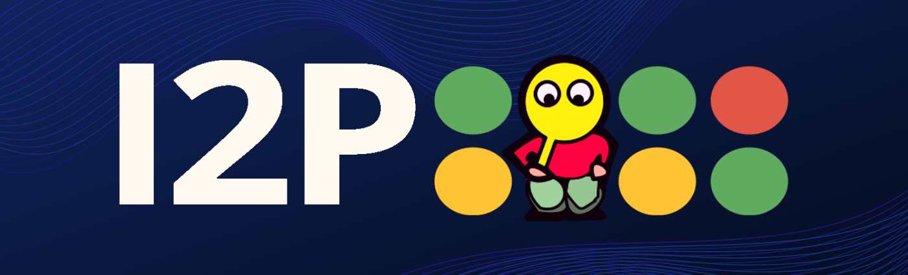

# Song of the Day: [Beaches - Beabadoobee](https://youtu.be/nNXSSfSmbao?start=1)

https://github.com/user-attachments/assets/35d0d567-b719-43d6-b535-6ca44f04d186

  <h1> 👋 Hey, I'm Michael 👋 </h1>

* I have been programming and in the cybersecurity space for about 4 years now, and loving every second of it :)

* I have a passion for web development (especially in Golang!) and I **love** making my own specialized versions of existing tools. 

* Learning about cybersecurity is one of my favorite things to do and I am deeply passionate about anonymity and digital privacy. 

* I am currently working on a utility for creating fork-bombs (so if you're a pentester give it a shot 😉) based on my promposal 2025.

## My Tech-Stack

# PSA: Join the I2P network.
Believe in decentralization of data? Care about anonymity? Free speech? Democracy? ***I2P's right there with you.***

<a href= "https://geti2p.net/en/">
